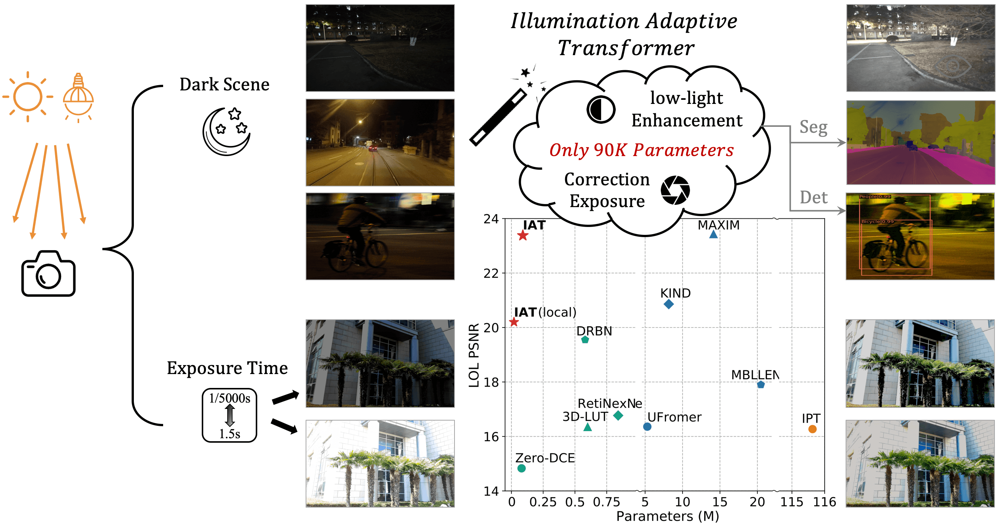
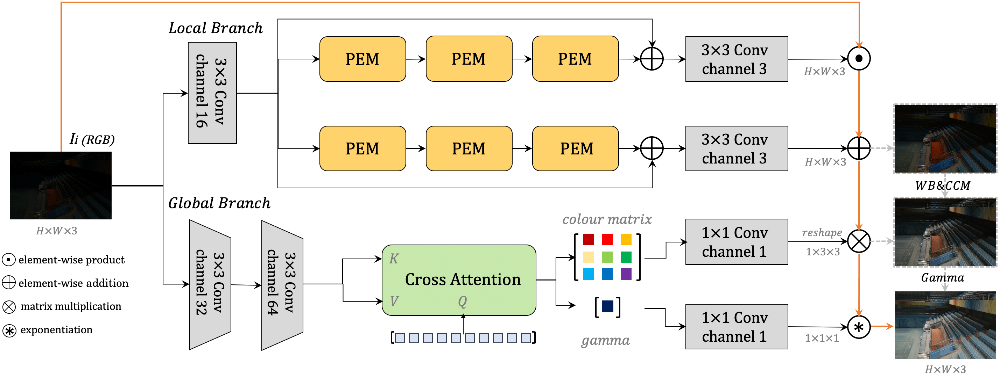
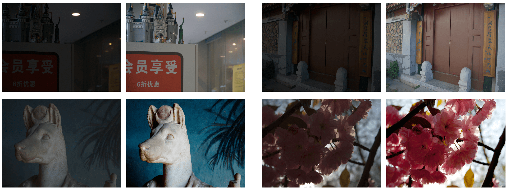
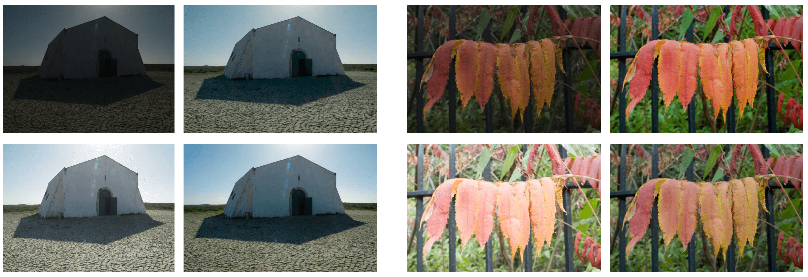
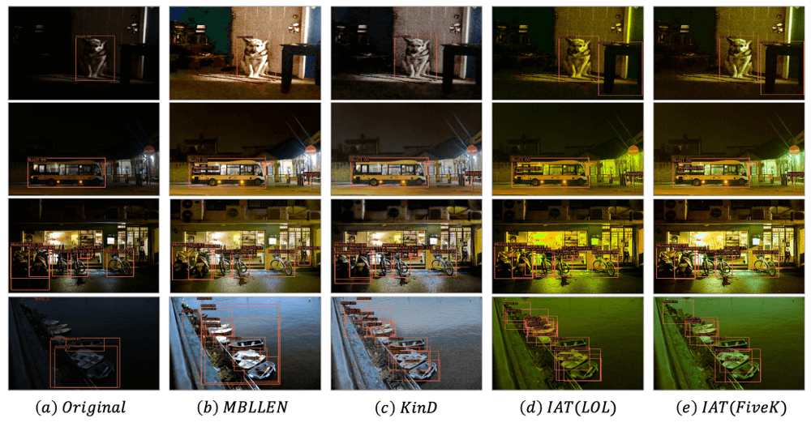

# <font color=red>You Only Need 90K Parameters to Adapt Light: a Light Weight Transformer for Image Enhancement and Exposure Correction. (BMVC 2022)</font> [(paper)](https://arxiv.org/abs/2205.14871)  [(zhihu中文解读)](https://zhuanlan.zhihu.com/p/535695807) 

**2023.3.2:** Renew the [img_demo.py](https://github.com/cuiziteng/Illumination-Adaptive-Transformer/blob/main/IAT_enhance/img_demo.py), you can directly use this for image enhancement and exposure correction.

**2022.10.16:** We add demos for low-light enhancement and exposure correction in [](https://huggingface.co/spaces/Andy1621/IAT_enhancement).

**2022.10.11:** Upload the low-light semantic segmentation code. See [segmentation](https://github.com/cuiziteng/Illumination-Adaptive-Transformer/tree/main/IAT_high/IAT_mmseg).

**2022.10.1:** Papar accepted by [**BMVC 2022**](https://bmvc2022.mpi-inf.mpg.de/238/)!

**2022.8.10:** Upload **LOL-V1** dataset training code.

**2022.8.3:** Upload the new [arxiv version](https://arxiv.org/abs/2205.14871), the rewnewed results on **LOL-V1** dataset (485 training images, 15 testing images) is **23.38** PSNR and **0.809** SSIM, the results on **LOL-V2-real** dataset (689 training images, 100 testing images) is **23.50** PSNR and **0.824** SSIM. Detail see this [issue](https://github.com/cuiziteng/Illumination-Adaptive-Transformer/issues/7).

**2022.7.11:** Upload the low-light object detection code. See [detection](https://github.com/cuiziteng/Illumination-Adaptive-Transformer/tree/main/IAT_high/IAT_mmdetection).

<br/>


## Reference:

Detection and Segmentation are use [mmdetection](https://mmdetection.readthedocs.io/en/latest/) and [mmsegmentation](https://mmsegmentation.readthedocs.io/en/latest/), some of the code are borrow from [Zero-DCE](https://github.com/Li-Chongyi/Zero-DCE) and [UniFormer](https://github.com/Sense-X/UniFormer), thanks them both so much!

Citation:
```
@article{cui2022illumination,
  title={Illumination Adaptive Transformer},
  author={Cui, Ziteng and Li, Kunchang and Gu, Lin and Su, Shenghan and Gao, Peng and Jiang, Zhengkai and Qiao, Yu and Harada, Tatsuya},
  journal={arXiv preprint arXiv:2205.14871},
  year={2022}
}
```


## Abstract

Challenging illumination conditions (low-light, under-exposure and over-exposure) in the real world not only cast an unpleasant visual appearance but also taint the computer vision tasks. After camera captures the raw-RGB data, it renders standard sRGB images with image signal processor (ISP). By decomposing ISP pipeline into local and global image components, we propose a lightweight fast **Illumination Adaptive Transformer (IAT)** to restore the normal lit sRGB image from either low-light or under/over-exposure conditions. Specifically, **IAT** uses attention queries to represent and adjust the ISP-related parameters such as colour correction, gamma correction. With only **～90k** parameters and **～0.004s** processing speed, our **IAT** consistently achieves superior performance over SOTA on the current benchmark low-light enhancement and exposure correction datasets. Competitive experimental performance also demonstrates that our **IAT** significantly enhances object detection and semantic segmentation tasks under various light conditions.

For Vision Tasks under various lighting conditions, towards both **Human Vision** :smile:  and **Machine Vision** :camera: 

**5 Tasks Under Various Lighting Conditions**: 1. Low-light Enhancement (LOL, MIT5K) // 2. [Exposure Correction](https://github.com/mahmoudnafifi/Exposure_Correction) // 3. [Low-Light Object Detection](https://arxiv.org/abs/1805.11227) // 4. [Low-Light Semantic Segmentation](https://openaccess.thecvf.com/content/ICCV2021/html/Sakaridis_ACDC_The_Adverse_Conditions_Dataset_With_Correspondences_for_Semantic_Driving_ICCV_2021_paper.html) // 5. [Various-Light Object Detection](https://bop.felk.cvut.cz/home/)

<!--  -->
<div align="center">
  
</div>
<p align="center">
  Figure 1: IAT (illumination-adaptive-transformer) for multi light conditions vision tasks, and the comparision results on LOL-V1 dataset.
</p>


<br/>

## Model Structure:

<!--  -->
<div align="center">
  
</div>
<p align="center">
  Figure 2: Model Structure of Illumination Adaptive Transformer.
</p>

Our IAT model consist of two individual branches, the local branch is for pixel-wise adjustment and ouputs two feature map for add and multiply. The global branch is for global-wise adjustment and outpus the color matrix and gamma value, global branch is inspired by [DETR](https://github.com/facebookresearch/detr), the network would updates color matrix and gamma value by a dynamic query learning way. BTW, the total model is only over **90k+** parameters and the inference speed is only **0.004s** per image on LOL dataset (single Nvidia-3090 GPU).

<br/>

## Usage:

Enviroment (install pytorch 1.7.1 or later, following [pytorch](https://pytorch.org/).):
```
$ conda create -n IAT python==3.7.0
$ conda activate IAT
$ conda install --yes -c pytorch pytorch=1.7.1 torchvision cudatoolkit=11.0
$ pip install timm matplotlib IQA_pytorch tqdm
```

For low-level vision (low-light enhancement, exposure correction):
```
cd IAT_enhance
```

For high-level vision (low-light detection, low-light semantic segmentation):
```
cd IAT_high
```

<br/>

## Demo:

<!--  -->
<div align="center">
  
</div>
<p align="center">
  Figure 3: IAT in low-light enhancement (LOL dataset, MIT-5K dataset).
</p>

<!--  -->
<div align="center">
  
</div>
<p align="center">
  Figure 4: IAT in exposure correction (Exposure dataset).
</p>

<!--  -->
<div align="center">
  
</div>
<p align="center">
  Figure 5: IAT in low-light detection (EXDark Dataset). Background image is the image generated by IAT while joint-training.
</p>


<br/>

## Related 

We also have another work about the **low-light object detection**, **ICCV 2021**: Multitask AET with Orthogonal Tangent Regularity for Dark Object Detection [(code)](https://github.com/cuiziteng/ICCV_MAET) [(paper)](https://openaccess.thecvf.com/content/ICCV2021/papers/Cui_Multitask_AET_With_Orthogonal_Tangent_Regularity_for_Dark_Object_Detection_ICCV_2021_paper.pdf), please read if you interest!

